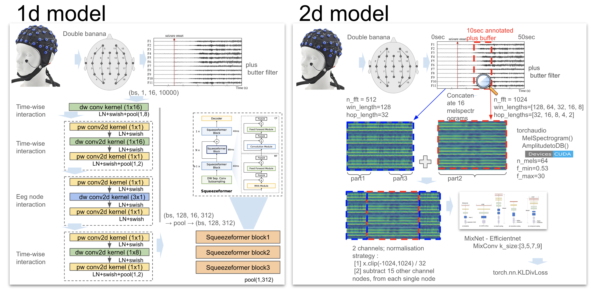

## Model2 - RSNA 2024 Lumbar Spine Degenerative Classification

This repository contains the codebase to reproduce model2 winning solution to the RSNA 2024 Lumbar Spine Degenerative Classification competition on kaggle.

Competiton website: [link](https://www.kaggle.com/competitions/rsna-2024-lumbar-spine-degenerative-classification).
3rd place solution summary: [link](?????).

Our solution is an ensemble of multiple models which train on study or series level for each individual intervertebral disc level.
Crops of the original MRI are isolated in a first stage and the severity of the condition is predicted using the sequence of crops. Final results are aggregated using an MLP model that directly optimizes the competition metric.



## Environment

Ensure to have a GPU with at least 24GB memory, along with a recent version of pytorch installed. Ideally inside a recent nividia pytorch container from the [ngc catalog](https://catalog.ngc.nvidia.com/orgs/nvidia/containers/pytorch).
After this, up the environment with,
```
pip install -r requirements_ngc.txt
```

By default training is logged via neptune.ai to a quickstart project. If you want to use your own neptune project set `cfg.neptune_project` in each of the config files (`config/` directory), which have the `cfg.neptune_project` parameter. A blog post discussing how we used neptune for a previous competition can be found [here](https://www.medium.com/@darragh.hanley_94135/mastering-mlops-with-neptune-ai-84e635d36bf2) .

### Preparation

Down load the competition data using the Kaggle API, and unzip it into the `datamount/` folder.
```
kaggle competitions download -c rsna-2024-lumbar-spine-degenerative-classification
```

We have provided a train file, `train_folded_v1.csv` which has a column `fold`, which assigns each patient to one of four folds.
Cache the dicoms as png by running,
```
python scripts/convert_dcm_v01.py
python scripts/convert_dcm_v04.py
```

We have also provided a file `sag_xy/shifted_spinenet_v02.csv.gz`.
This is the result of passing the dicoms to spinenet and extracting the top right corner of the intervertebral disc and shifting the interverbral disks up or down one level based on the competition coordinates.
You have the cached results, but if you wish to reproduce, run the below two scripts.
```
python scripts/make_sag_loc_labels_part1.py
python scripts/make_sag_loc_labels_part2.py
```

Create a pickle file to cache the metadata,
```
python scripts/make_meta_v01.pkl.py
```

### Model config tables

| Task Description    | Input Dicom Type    | Config | Dataset | Model | Postprocess | Metric |
| -------- | ------- | ------- | ------- | ------- | ------- | ------- |
| Axial xy-localisation | Axial T2  | cfg_dh_05b5_loc    | ds_dh_4a2    | mdl_dh_4a2    | pp_dummy | default_metric |
| Axial xy-localisation inference | Axial T2  | cfg_dh_05b5_loc_test2    | ds_dh_4a3    | mdl_dh_4a2    | pp_dummy | default_metric |
| Sagittal xy-localisation | Sagittal T1/T2  | cfg_dh_14p2_locsag    | ds_dh_11g    | mdl_dh_4b2    | pp_dummy | default_metric |
| Sagittal xy-localisation inference | Sagittal T1/T2  | cfg_dh_14p2_locsag_test    | ds_dh_11g    | mdl_dh_4b2    | pp_dummy | default_metric |
| Sagittal z-localisation | Sagittal T1/T2  | cfg_dh_14s10a_locsag    | ds_dh_11n4    | mdl_dh_4h4    | pp_dummy | default_metric |
| Axial classification | Axial T2 | cfg_dh_29a2    | ds_dh_23a    | mdl_dh_23a   | pp_dh_04 | metric_dh_02 |
| Sagittal classification | Axial T2 | cfg_dh_29g    | ds_dh_23j   | mdl_dh_23c   | pp_dh_04 | metric_dh_02 |
| Sagittal classification | Sagittal T1/T2 | cfg_dh_12y8    | ds_dh_12s3    | mdl_dh_12a4   | pp_dh_02 | metric_dh_02 |

### Training

To train all, run the following on a four node machine,
```
# Train xy localisation models
bash train_parallel.sh '0 1 2 3' '0 1 2 3' -C cfg_dh_05b5_loc
bash train_parallel.sh '0 1 2 3' '0 1 2 3' -C cfg_dh_14p2_locsag
bash train_parallel.sh '-1 -1 -1 -1' '0 1 2 3' -C cfg_dh_05b5_loc
bash train_parallel.sh '-1 -1 -1 -1' '0 1 2 3' -C cfg_dh_14p2_locsag

# Run inference on these configs.
bash infer_model1.sh cfg_dh_05b5_loc_test2 cfg_dh_05b5_loc
bash infer_model1.sh cfg_dh_14p2_locsag_test cfg_dh_14p2_locsag

# Aggregate the xy localisation results to a file
python aggregate_localisation.py

# Train z localisation models
bash train_parallel.sh '0 1 2 3' '0 1 2 3' -C cfg_dh_14s10a_locsag
bash train_parallel.sh '-1 -1 -1 -1' '0 1 2 3' -C cfg_dh_14s10a_locsag

# Aggregate the z-localisation results to a file
python aggregate_z_localisation.py

# Train model 2 models
bash train_parallel.sh '0 1 2 3' '0 1 2 3' -C cfg_dh_29a2
bash train_parallel.sh '0 1 2 3' '0 1 2 3' -C cfg_dh_29g
bash train_parallel.sh '0 1 2 3' '0 1 2 3' -C cfg_dh_12y8
bash train_parallel.sh '-1 -1 -1 -1' '0 1 2 3' -C cfg_dh_29a2
bash train_parallel.sh '-1 -1 -1 -1' '0 1 2 3' -C cfg_dh_29g
bash train_parallel.sh '-1 -1 -1 -1' '0 1 2 3' -C cfg_dh_12y8
```

Upload all the weights to kaggle datasets.


